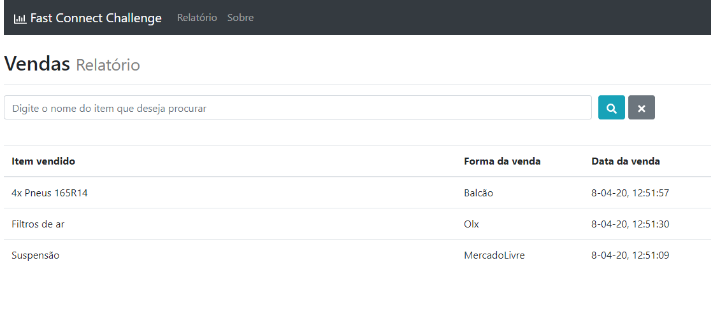

<h1 align="center">
	Fast Connect Challenge
</h1>

 

  

<h4 align="center">
  Guilherme Fünkler Borelli
</h4>

  <a href="#wrench-tecnologias">Tecnologias</a>&nbsp;&nbsp;&nbsp;|&nbsp;&nbsp;&nbsp;
  <a href="#-projeto">Projeto</a>&nbsp;&nbsp;&nbsp;|&nbsp;&nbsp;&nbsp;
  <a href="#memo-observações">Observações</a>

## :wrench: Tecnologias

Esse projeto foi desenvolvido com as seguintes tecnologias:

- [Node.js](https://nodejs.org/en/)
- [React](https://reactjs.org)
- [MongoDB](https://www.mongodb.com/)
- [Redux](https://redux.js.org/)
- Diversas tecnologias menores como React Bootstrap, React Icons, MomentJS, Create-React-App etc

## 💻 Projeto

O desafio é um projeto que visa facilitar o controle de vendas.

## :memo: Observações

Algumas coisas não ficaram como eu desejava, o Redux-Form está apresentando um pequeno bug onde perde o foco no input mas no primeiro dígito apenas, mas isso não inutiliza o sistema, além disso queria tratar as mensagens de erro com o Toastr para ser possível fazer requisitos de senha email etc de uma forma moderna, não um simples alert do backend, e por fim, desejava colocar no Heroku ou AWS, mas dentro do prazo que me foi dado, foi o que consegui desenvolver. 

## 📚 Instruções

É necessário ter o mongo instalado e configurado para o backend funcionar corretamente.
Pensei em implementar função para adicionar vendas também, mas por não fazer parte do desafio achei melhor não faze-lo, sendo assim é necessário incluir uma coleção de exemplos que está neste repositório(exemploMongo.json) ou caso deseje, persistir os dados numa coleção do mongo que deverá se chamar 'sales'.

Para rodar a aplicação utilizar o comando 'npm i' nos diretórios 'backend' e no 'frontend', após concluída a instalação dos pacotes, utilizar os comandos 'npm start' nos diretórios 'backend' e no 'frontend', a aplicação iniciará automaticamente.
